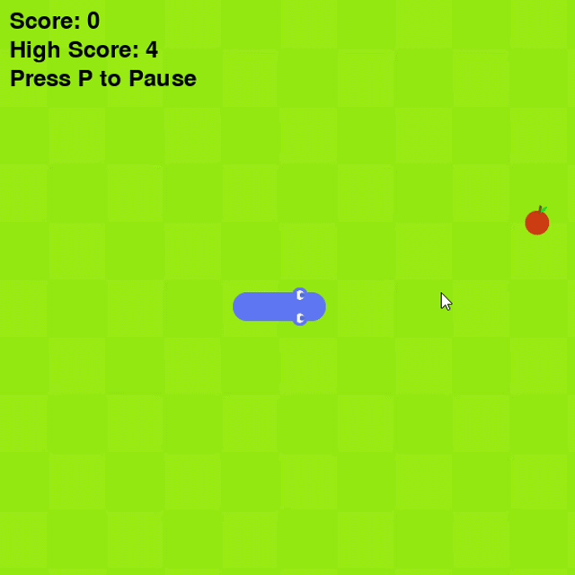

# 🐍 Snake Xenzia Game (Pygame)

A classic Snake Game built using **Python and Pygame**, featuring custom graphics, smooth gameplay, and score tracking.

---

## 🚀 Features
- 🎮 Smooth snake movement with directional controls  
- 🍎 Food spawning system  
- 📈 Score & High Score tracking (stored locally)  
- 🔁 Restart functionality (Press Enter)  
- ⏸️ Pause/Resume feature (Press P)  
- 🎨 Custom snake graphics (head, body, tail)  
- 💀 Collision detection (wall + self)

---

## 🛠️ Tech Stack
- Python  
- Pygame  

---
---

## ▶️ How to Run

1. Install dependencies:
```bash
pip install pygame

2. Run the game:
python snake_Xenzia.py

## 🎮 Gameplay Preview


